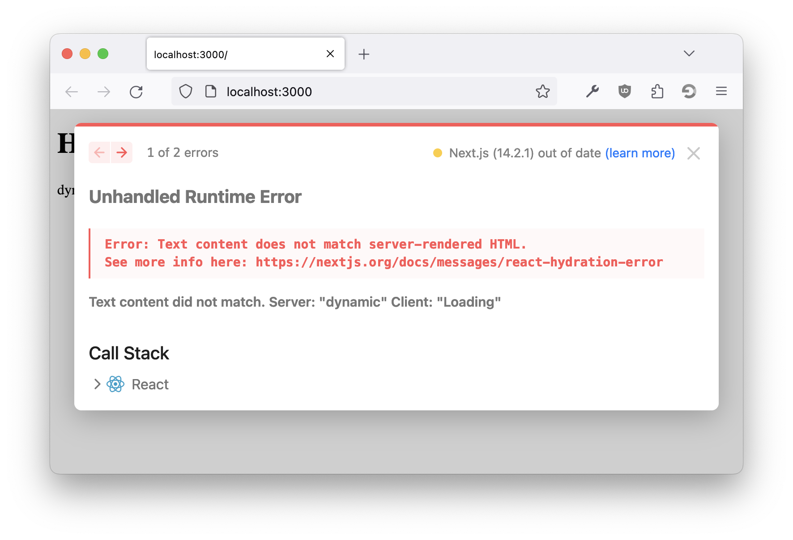

# next/dynamic + src folder + babel

Reproducible example to show that using `next/dynamic` breaks when used with a src folder and babel.

## Description

When you use `next/dynamic` with babel and a src folder, you will get a hydration mismatch when opening your page.



## Steps to reproduce

```
yarn install
yarn dev
open http://localhost:3000
```
